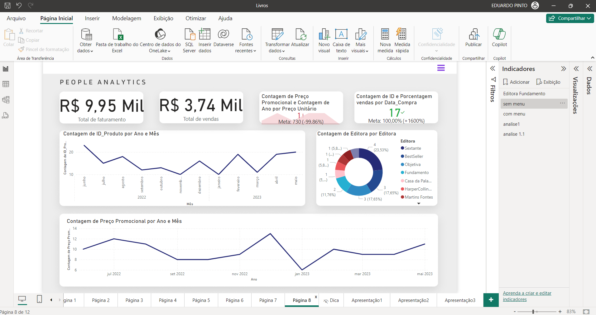

<h1>PowerBi exercício 2 - Livros</h1>

<h2>�� Sobre</h2>

Dashboard criado para praticar os Cursos: 
-Power BI: DAX contextos e iteração 
-Power BI: aprofundando na linguagem DAX 
-Power BI: explorando recursos visuais 
-Power BI: conhecendo o serviço 

<h2>Análise de dados:</h2>

<h2>��Formação PowerBi / ALURA</h2>

-Aprender como criar colunas calculadas e medidas 
-Entender como lidar com erros no DAX 
-Reconhecer quando deve utilizar uma coluna calculada ou medida 
-Compreender o conceito de agregação 
-Conhecer o contexto de filtro e de linha 
-Compreender as funções iteradoras no DAX 
-Aprender a utilizar variáveis 
-Criar medida com a função CALCULATE 
-Combinar a função CALCULATE para obter medidas elaboradas 
-Entender como a função CALCULATE sobrescreve ou agrega com outros filtros 
-Entender como formular uma pergunta para o Power BI sugerir uma visualização baseada nos seus dados 
-Realizar a previsão e localização de anomalias em série temporais no relatório Power BI 
-Compreender como a análise automatica do Power BI pode explicar flutuações nos gráficos 
-Estruturar uma apresentação dinâmica com um relatório Power BI 
-Aplicar alternativas de acessibilidade para os relatórios construídos em Power BI 
-Aprender a criar vários conteúdos como relatórios, painéis, métricas e aplicativos do Power BI 
-Entender alternativas para manter seus conteúdos com dados atualizados 
-Realizar o compartilhamento do workspace com as pessoas com quem você trabalha limitando funcionalidades 

## �� Tecnologias

  

